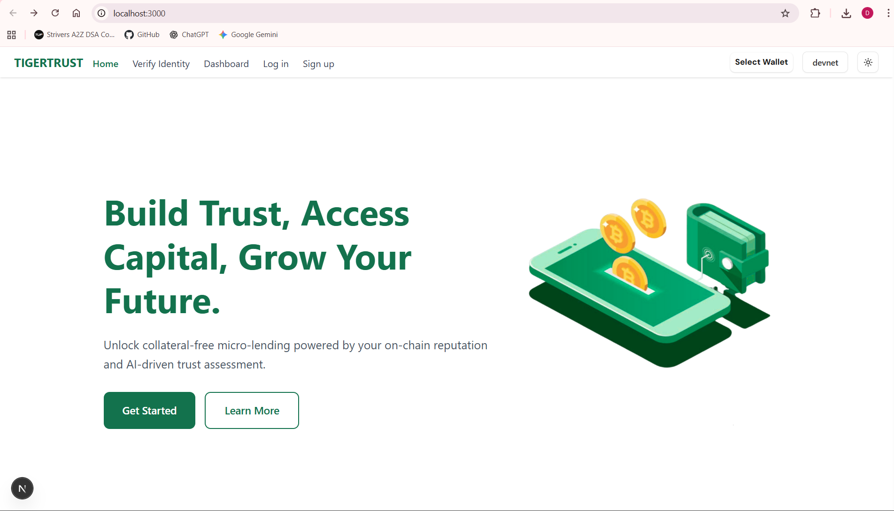
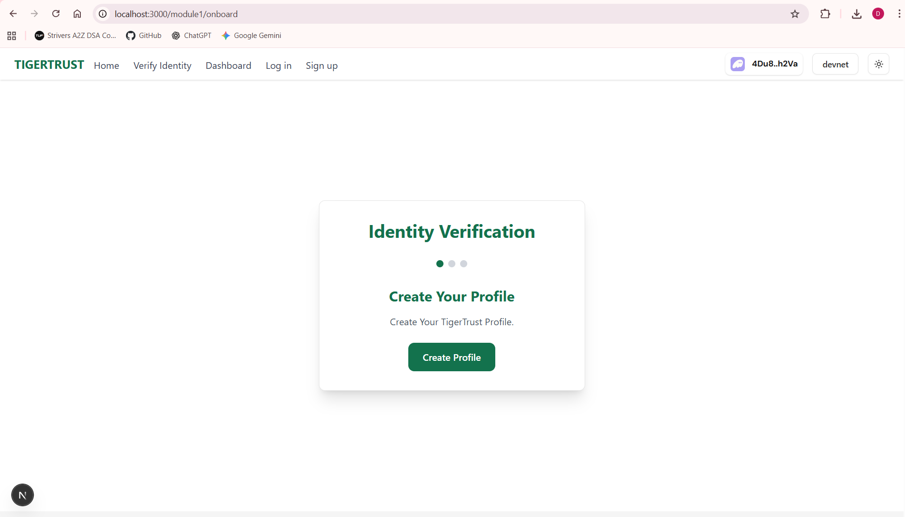
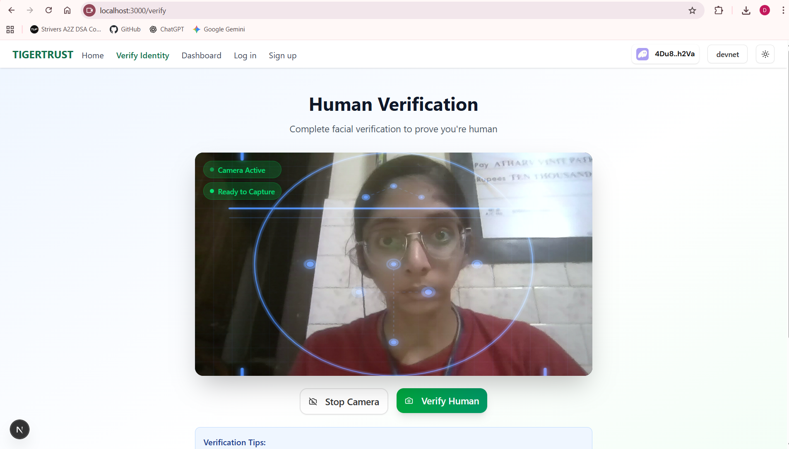
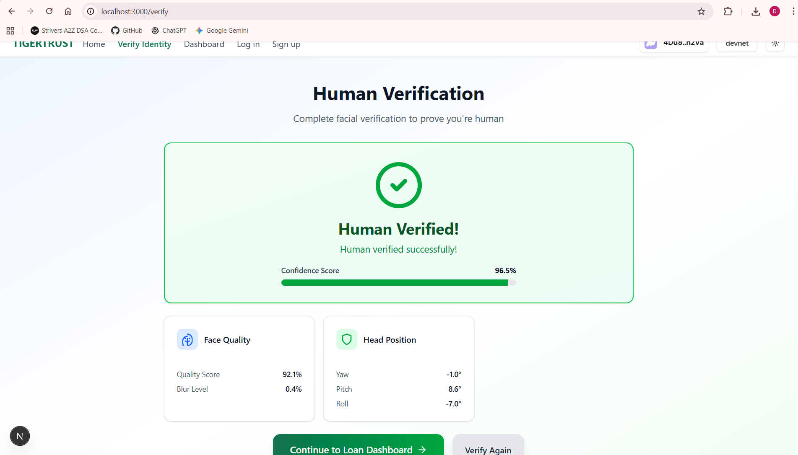
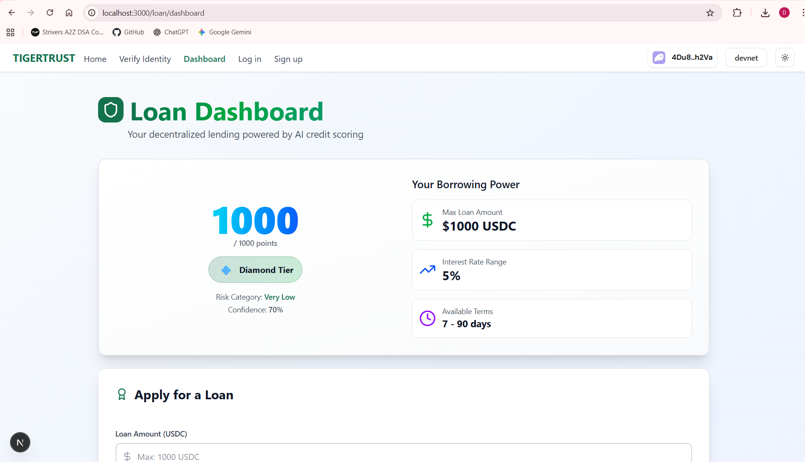
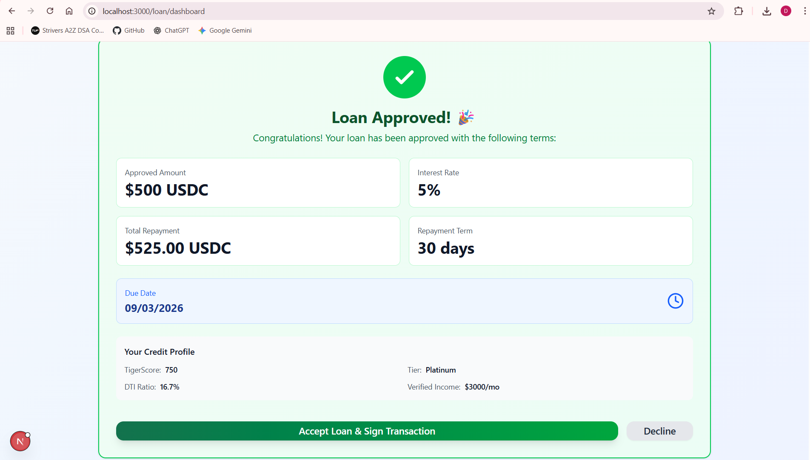
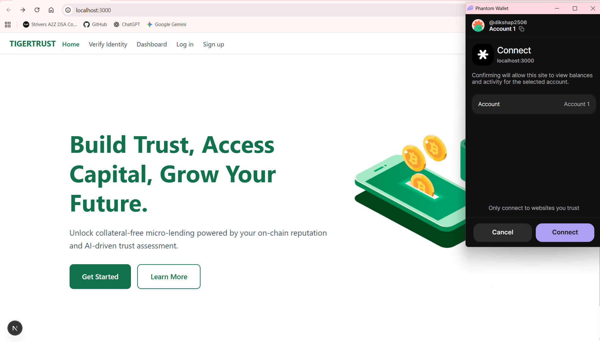
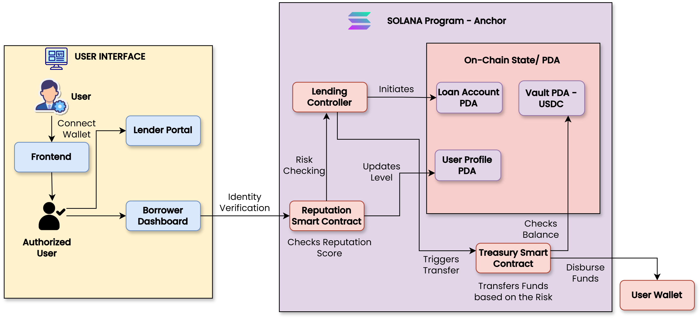

# 🐅 TigerTrust

**Build Trust, Access Capital, Grow Your Future**

TigerTrust is a revolutionary decentralized micro-lending platform that provides collateral-free loans powered by on-chain reputation and AI-driven trust assessment. Built on Solana blockchain, TigerTrust democratizes access to capital through innovative credit scoring and seamless DeFi integration.

[](https://nextjs.org/)
[](https://solana.com/)
[](https://www.typescriptlang.org/)
[](https://www.anchor-lang.com/)

## 🚀 Features

### 🎯 **AI-Powered Credit Scoring (TigerScore)**
- **Real-time Scoring**: Dynamic credit assessment based on transaction history, loan repayment patterns, and on-chain activity
- **Multi-factor Analysis**: Comprehensive evaluation including wallet age, transaction count, income verification, and debt-to-income ratios
- **Tier-based System**: Bronze, Silver, Gold, Platinum, and Diamond tiers with increasing borrowing power

### 🔐 **Advanced Identity Verification**
- **Biometric Liveness Check**: Face++ API integration for human verification
- **Anti-fraud Protection**: Prevents bot applications and ensures authentic users
- **Camera-based Verification**: Real-time facial recognition and liveness detection
- **Privacy-first Approach**: Secure verification without compromising user privacy

### 💰 **Flexible Lending Solutions**
- **Collateral-free Loans**: Access capital without locking up assets
- **Multi-tier Loan Limits**: From $50 (Entry) to $1000+ (Elite) based on TigerScore
- **Competitive Interest Rates**: 5-15% APR based on creditworthiness
- **Flexible Terms**: 7, 15, 30, 60, and 90-day repayment options
- **Instant Decisions**: Real-time loan approval using AI assessment

### ⛓️ **Blockchain-Native Infrastructure**
- **Solana Integration**: Fast, low-cost transactions on Solana blockchain
- **Anchor Smart Contracts**: Secure, auditable loan and user profile management
- **Wallet Adapter Support**: Seamless integration with popular Solana wallets
- **On-chain Reputation**: Immutable credit history stored on blockchain

### 📊 **Comprehensive Dashboard**
- **TigerScore Monitoring**: Real-time credit score tracking and improvement suggestions
- **Loan Management**: Active loan tracking, repayment schedules, and history
- **Borrowing Power Calculator**: Personalized loan limit recommendations
- **Performance Analytics**: Detailed insights into creditworthiness factors

### 🔄 **Real-time Updates**
- **Live Score Updates**: TigerScore recalculation triggered by on-chain activities
- **Automated Assessments**: Continuous monitoring of user financial behavior
- **Dynamic Risk Evaluation**: Real-time adjustment of loan terms and limits

## 📸 Screenshots

### 🏠 **Landing Page & Hero Section**
*Clean, modern interface showcasing TigerTrust's value proposition*



### 🚀 **User Onboarding Flow**
*Streamlined onboarding process with wallet connection and profile creation*



### 🔐 **Human Verification System**
*Advanced biometric liveness check using Face++ API integration*




### 📊 **TigerScore Dashboard**
*Comprehensive credit score monitoring with tier visualization and borrowing power*



### 💰 **Loan Application Interface**
*Intuitive loan application form with real-time eligibility calculation*


### ✅ **Loan Approval & Terms**
*Instant loan decision with detailed terms and repayment schedule*



### 👛 **Wallet Integration**
*Seamless Solana wallet connectivity with multiple wallet support*



## 🌟 Unique Selling Propositions (USPs)

### 1. **First Truly Decentralized Credit Scoring**
Unlike traditional credit systems, TigerTrust creates credit scores based entirely on verifiable on-chain data, making it accessible to anyone with a Solana wallet, regardless of traditional banking history.

### 2. **AI-Driven Risk Assessment**
Our proprietary Gemini AI integration provides sophisticated risk analysis that traditional credit systems cannot match, considering hundreds of on-chain behavioral patterns.

### 3. **Zero Collateral Requirements**
Revolutionary approach to DeFi lending - no need to lock up valuable crypto assets as collateral. Your reputation is your collateral.

### 4. **Instant Global Access**
Geographic boundaries don't exist in our system. Anyone, anywhere can access micro-loans as long as they have internet and a Solana wallet.

### 5. **Transparent & Immutable**
All credit history and loan data is stored on blockchain, providing complete transparency while remaining privacy-focused.

### 6. **Scalable Micro-finance**
Purpose-built for micro-loans that traditional banks ignore, serving the underbanked and unbanked populations globally.

## 🏗️ Architecture

*TigerTrust's comprehensive system architecture showcasing the integration between frontend, backend services, and blockchain infrastructure*



### System Components

#### **Frontend (Next.js)**
- Modern React-based user interface with Tailwind CSS
- Wallet adapter integration for Solana connectivity
- Real-time dashboard with comprehensive loan management
- Mobile-responsive design with dark/light theme support

#### **Backend Services**
1. **AI Scoring API (Python/Flask)** - Port 5001
   - Gemini AI integration for credit scoring
   - Real-time score calculation and updates
   - Risk assessment and tier classification

2. **Human Verification (Python/Flask)** - Port 5000
   - Face++ API integration for biometric verification
   - Liveness detection and anti-fraud measures
   - Secure image processing and validation

3. **Loan Decision Engine (Node.js)** - Port 3002
   - Real-time loan application processing
   - Automated approval/rejection based on TigerScore
   - Interest rate and term calculation

4. **RSE Server (Node.js/TypeScript)** - Port 4000
   - Real-time Scoring Engine
   - Helius API integration for blockchain data
   - Transaction monitoring and score updates

#### **Blockchain Layer (Solana/Anchor)**
- **User Profile Program**: Manages user identity and TigerScore on-chain
- **Counter Program**: Demo program for showcase purposes
- Smart contract deployment and interaction via Anchor framework

## 📦 Installation & Setup

### Prerequisites
- Node.js 18+ and npm
- Python 3.8+
- Rust and Anchor CLI
- Solana CLI tools

### Quick Start

1. **Clone the repository**
   ```bash
   git clone https://github.com/chiragvispute/TigerTrust.git
   cd TigerTrust
   ```

2. **Install dependencies**
   ```bash
   npm install
   ```

3. **Set up environment variables**
   ```bash
   cp .env.example .env
   # Edit .env with your API keys and configuration
   ```

4. **Start all backend services**
   ```bash
   python start_backends.py
   ```

5. **Start the frontend**
   ```bash
   npm run dev
   ```

6. **Deploy Anchor programs** (Optional)
   ```bash
   npm run anchor-build
   npm run anchor-deploy
   ```

### Environment Configuration

Create a `.env` file in the root directory:

```env
# Solana Configuration
SOLANA_RPC_URL=https://api.devnet.solana.com
ANCHOR_WALLET=~/.config/solana/id.json

# API Keys
GEMINI_API_KEY=your_gemini_api_key
FACEPP_API_KEY=your_facepp_api_key
FACEPP_API_SECRET=your_facepp_secret
HELIUS_KEY=your_helius_api_key

# Service Ports
AI_SCORING_PORT=5001
HUMAN_VERIFICATION_PORT=5000
LOAN_DECISION_PORT=3002
RSE_SERVER_PORT=4000
```

## 🎮 Usage

### For Borrowers

1. **Connect Wallet**: Link your Solana wallet to the platform
2. **Create Profile**: Set up your on-chain identity and undergo verification
3. **Human Verification**: Complete biometric liveness check
4. **Get Scored**: Receive your initial TigerScore based on wallet activity
5. **Apply for Loans**: Request loans up to your approved limit
6. **Manage Loans**: Track repayments and improve your score

## 🛠️ Technology Stack

### Frontend
- **Next.js 16**: React framework with App Router
- **TypeScript**: Type-safe development
- **Tailwind CSS**: Utility-first styling
- **Solana Wallet Adapter**: Wallet connectivity

### Backend
- **Python/Flask**: AI scoring and human verification services
- **Node.js/Express**: Loan decision and RSE services
- **TypeScript**: Type-safe backend development

### Blockchain
- **Solana**: High-performance blockchain platform
- **Anchor**: Solana program development framework
- **Rust**: Systems programming for smart contracts

### AI/ML
- **Gemini AI**: Advanced language model for credit assessment
- **Face++**: Computer vision for biometric verification
- **Custom Algorithms**: Proprietary scoring mechanisms

### APIs & Services
- **Helius**: Solana blockchain data and webhooks
- **Stripe**: Payment processing and income verification
- **Real-time Updates**: WebSocket connections for live data

## 📊 Loan Tiers & Terms

| Tier | Min TigerScore | Max Loan | Interest Rate | Max DTI | Description |
|------|----------------|----------|---------------|---------|-------------|
| 🥉 **Bronze** | 0-199 | $50 | 15% | 20% | Entry-level micro-loans |
| 🥈 **Silver** | 200-399 | $150 | 10% | 30% | Intermediate borrowers |
| 🥇 **Gold** | 400-599 | $500 | 7% | 40% | Trusted borrowers |
| 💎 **Platinum** | 600-799 | $1,000 | 5% | 50% | Elite borrowers |
| 💠 **Diamond** | 800+ | $2,000+ | 3% | 60% | Premium tier |

**Available Terms**: 7, 15, 30, 60, and 90 days

## 🔐 Security Features

- **Biometric Verification**: Face++ liveness detection
- **Smart Contract Auditing**: Anchor framework security
- **Rate Limiting**: API protection against abuse
- **Data Encryption**: Secure storage of sensitive information
- **Multi-signature Wallets**: Enhanced security for admin functions

## 🙏 Acknowledgments

- Solana Foundation for blockchain infrastructure
- Anchor team for smart contract framework
- Google for Gemini AI API access
- Face++ for biometric verification services
- Helius for blockchain data services

---

**TigerTrust** - Democratizing access to capital through blockchain innovation and AI-powered trust assessment.

*Built with ❤️ for the decentralized future of finance.*